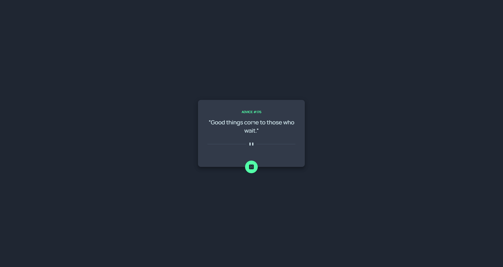

# Frontend Mentor - Advice generator app solution

This is a solution to the [Advice generator app challenge on Frontend Mentor](https://www.frontendmentor.io/challenges/advice-generator-app-QdUG-13db). Frontend Mentor challenges help you improve your coding skills by building realistic projects.

## Table of contents

- [Overview](#overview)
  - [Screenshot](#screenshot)
  - [Links](#links)
- [My process](#my-process)
  - [Built with](#built-with)
  - [What I learned](#what-i-learned)

## Overview

### Screenshot


### Links

- Solution URL: [https://github.com/FamilyMan/portfolio/tree/main/pages/advice-generator-app](https://github.com/FamilyMan/portfolio/tree/main/pages/advice-generator-app)
- Live Site URL: [https://familyman.github.io/portfolio/advice-generator-app](https://familyman.github.io/portfolio/advice-generator-app)

## My process

### Built with

- [Vuetify](https://vuetifyjs.com/)
- [Vue.js](https://vuejs.org/)
- [Nuxt.js](https://nuxtjs.org/)

### What I learned

I learnt that I can declare variables in page styles like this:

```css
::v-deep {
  --light-cyan: hsl(193, 38%, 86%);
  --neon-green: hsl(150, 100%, 66%);
  --grayish-blue: hsl(217, 19%, 38%);
  --dark-grayish-blue: hsl(217, 19%, 24%);
  --dark-blue: hsl(218, 23%, 16%);
}
```

And then I can reference them like this:

```js
style="font-size: 28px;color: var(--light-cyan)"
```
