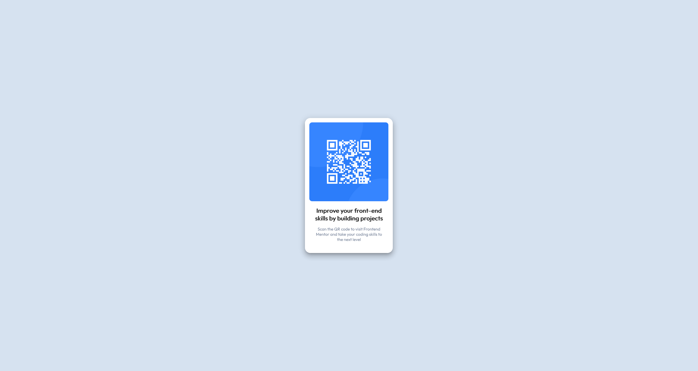

# Frontend Mentor - QR code component solution

This is a solution to the [QR code component challenge on Frontend Mentor](https://www.frontendmentor.io/challenges/qr-code-component-iux_sIO_H). Frontend Mentor challenges help you improve your coding skills by building realistic projects. 

## Table of contents

- [Overview](#overview)
  - [Screenshot](#screenshot)
  - [Links](#links)
- [My process](#my-process)
  - [Built with](#built-with)
  - [What I learned](#what-i-learned)

## Overview

### Screenshot


### Links

- Solution URL: [https://github.com/FamilyMan/portfolio](https://github.com/FamilyMan/portfolio)
- Live Site URL: [https://familyman.github.io/portfolio/qr-code](https://familyman.github.io/portfolio/qr-code)

## My process

### Built with

- [Vuetify](https://vuetifyjs.com/)
- [Vue.js](https://vuejs.org/)
- [Nuxt.js](https://nuxtjs.org/)

### What I learned

I learnt that I can run a static site on GitHub.

To do this for a nuxt project do the following:

Create a repository in GitHub and push your nuxt app to it.

In nuxt.config.js add the following to the export default object:

<pre>
  target: 'static',
  router: {
    base: '/github-repo-name>'
  }
</pre>

Install the gh-pages package by using:

npm i gh-pages

Add the following to package.json scripts object:

<pre>
  "predeploy": "nuxt generate",
  "deploy": "gh-pages -d dist"
</pre>

Add an empty file named .nojekyll to the project's root directory.

All references to sources must have relative paths, not absolute, e.g.

<pre>
  img src="/pic.jpg" should be changed to img src="pic.jpg"
  ```
     should be changed to 
  ```
</pre>

Run the following to deploy your app to GitHub pages:

<pre>npm run deploy</pre>

After a few minutes the app should be available at:

github-username/github.io/github-repo-name
