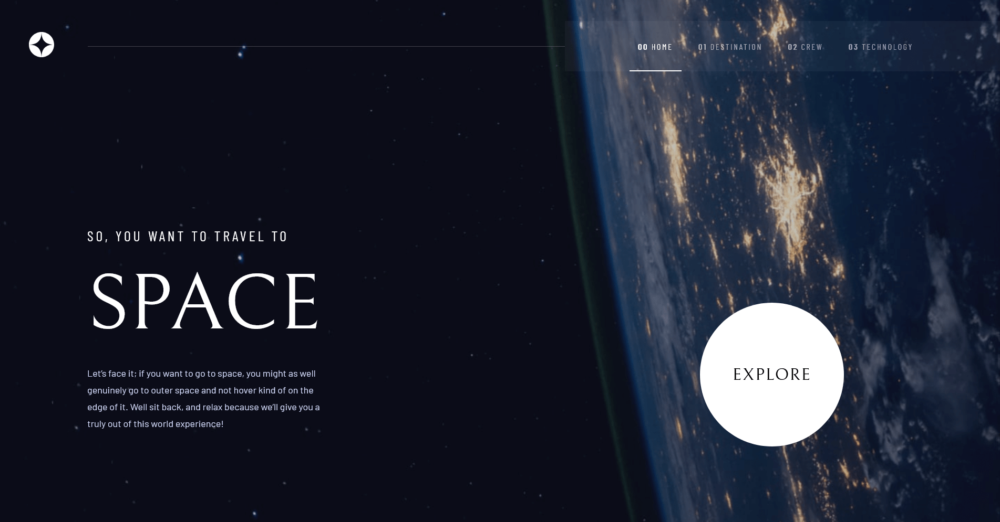

# Frontend Mentor - Space tourism website solution

This is a solution to the [Space tourism website challenge on Frontend Mentor](https://www.frontendmentor.io/challenges/space-tourism-multipage-website-gRWj1URZ3). Frontend Mentor challenges help you improve your coding skills by building realistic projects. 

## Table of contents

- [Overview](#overview)
  - [The challenge](#the-challenge)
  - [Screenshot](#screenshot)
  - [Links](#links)
- [My process](#my-process)
  - [Built with](#built-with)
  - [What I learned](#what-i-learned)
  
## Overview

### The challenge

Users should be able to:

- View the optimal layout for each of the website's pages depending on their device's screen size
- See hover states for all interactive elements on the page
- View each page and be able to toggle between the tabs to see new information

### Screenshot

### Links

- Solution URL: [https://github.com/FamilyMan/portfolio/tree/main/pages/space-tourism](https://github.com/FamilyMan/portfolio/tree/main/pages/space-tourism)
- Live Site URL: [http://localhost:3000/portfolio/space-tourism](http://localhost:3000/portfolio/space-tourism)

## My process

### Built with

- [Vuetify](https://vuetifyjs.com/)
- [Vue.js](https://vuejs.org/)
- [Nuxt.js](https://nuxtjs.org/)

### What I learned

I learnt that you can use srcset to provide a selection of images that the browser can then select which fits best.
